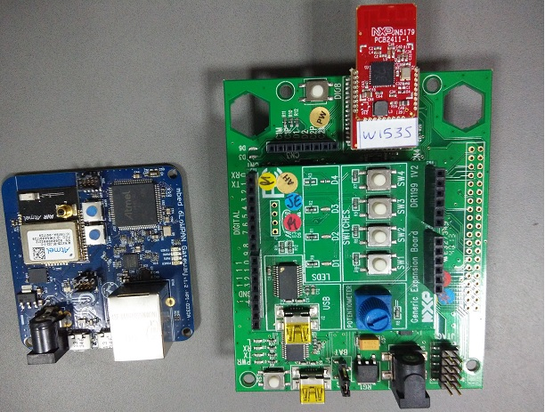

# Minimal Thread demonstrator

This document describes briefly the content of Thread demonstrator

## Required hardware



* mbed GW, 2.4 Ghz
* NXP DK4 DR1174 base board with DR1199 General Expansion Board & JN5179 Wireless MCU module boards (2 in number)
* Ubisys 802.15.4 RF sniffer for 2.4 Ghz
* Laptop with mDS server running

This demo uses an mbed GW router board and NXP JN5179 Wireless MCU modules. Sniffer is used with Wireshark.

## Required software

* mbed OS build tools.
* mbed Device Server on local laptop.
* [Wireshark](https://www.wireshark.org/) (nework debugging tool)

## The Demonstrator

The mbed CoAP example demonstrates how you can control the mbed device with CoAP messages over 6LoWPAN network. You can make CoAP requests to different resources, for example your IP address or device name. To send a CoAP notification message to the backend server, you just need to click **SW2** on the NXP DR1199 Generic Expansion board. We will also demonstrate how nodes can communicate without the border router.

The router application is configured to use RF channel 24.

### Setup.
1. Set everything on desk, unpowered.
2. Connect mbed GW with ethernet cable to mDS. (do not power it)
3. Start up the mDS server.
4. Open "Connected Home" view from http://localhost:8082
4. Start Wireshark to listen for channel 24.

### Running the demo
1. Power up NXP DK4 DR1174 boards by connecting to host PC using USB cable, one by one. Try to leave 3 seconds interval. This ensures that one of the nodes will became a leader.
2. Power up mbed GW.
3. Now you can show Wireshark running. There should be lots of MLE and some CoAP traffic ongoin. This is the negotiation phase.
4. Once you start seeing CoAP messages with URL like `POST /rd?ep=MBED-fcc...` they have joined the mDS server.
5. Open mDS view to show that they have been connected (as shown in mDS_homepage.jpg).
6. Demonstrate that you can change the toggling of LEDs on NXP DR1199 Generic expansion board by clicking resource `/hw/led` (as shown in mDS_LED_Button.jpg)
7. Now you can show that nodes are able to talk to each others directly by clicking SW2 button on any node. This should turn LED color on other nodes.
8. You can now disconnect the mbed GW
9. Show that nodes can still communicate by clicking any *SW2* button.
10. Connect back the border router.
11. Wait 10 seconds. Try if you can still communicate through mDS.


-------------

*NOTE: Rest of this document covers build&setup phases.*


## Preparing the Gateway

### Flashing router application

The router firmware image is located in the root folder of the mbed-thread-example application in mbed-thread-example application in mbed GitHub called `6LP_Gateway_Thread.bin`.

Connect the mbed gateway to your computer with a micro USB cable. It will be shown in your computer as a removable Mass Storage Device. Copy the `6LP_Gateway_Thread.bin` file to the mbed gateway to flash the device. To reboot the new firmware, click the **Reset** button on the board after flashing.

### Connecting the Gateway

Connect your Ethernet port to the mbed GW router. You can connect directly using the Ethernet cable between your computer and the gateway or you can use an Ethernet switch between your devices.

In case of direct Ethernet cable, you may need to use a cross-over cable if your Ethernet adapter does not support non-cross cables between devices. All gigabit LAN ports should be supported.

This is enough to provide limited IPv6 connectivity between your computer and the 6LoWPAN network.

In this demonstration, the following IPv6 addresses are used:

host | IPv6 address
-----|-------------
Your computer | `fd00:ff1:ce0b:a5e0::1`
Thread gateway | `fd00:ff1:ce0b:a5e0:<generated from MAC>`
Thread node | `fd00:ff1:ce0b:a5e1:<generated from MAC>`

## Setting up the IPv6 environment

Thread network requires IPv6 connectivity. In this demonstration, we
use local IPv6 address space and no IPv6 connectivity to external networks is required.
In the demonstrator we use ULA prefixes `fd00:ff1:ce0b:a5e0::/64` and `fd00:ff1:ce0b:a5e1::/64` for the Thread.

Set your computer to run on IP address `fd00:ff1:ce0b:a5e0::1` and use 64bit
network mask (`fd00:ff1:ce0b:a5e0::1/64`).

### Setting up IPv6 in Linux
Run the following command in a terminal:
```
ifconfig eth0 add fd00:ff1:ce0b:a5e0::1/64
```
Connect to the Thread network through the border router. The connection takes place automatically if the routing table listens to the router's advertisements. You can also configure the routing table manually to listen to the router directly.

#### Configure the routing table automatically

**Step 1.** Determine if your Linux machine is configured as router by running the following command:
```
sysctl -a | grep forwarding
```
If any of the values are set to `1`, your machine is configured as a router.

**Step 2.** If your machine is configured as a router, run the following command:
```
sysctl -w net.ipv6.conf.eth0.accept_ra=2
```
Otherwise, run this command:
```
sysctl -w net.ipv6.conf.eth0.accept_ra=1
```

#### Configure the routing table manually
If you cannot configure the routing table to connect automatically, follow these steps:

**Step 1.** Use Wireshark to find the gateway address **OR** give the following command:
```
ip -6 neigh
```
The gateway IP address will begin with `fe80::fec2:`

**Step 2.** Give the following command:
```
sudo ip -6 route add fd00:ff1:ce0b:a5e1::/64 via <GW IP address> dev eth0
```
**NOTE:** If `eth0` is **not** the proper interface, replace it with the appropriate interface.

### Setting up IPv6 in OS X

1. Go to **Network Settings**.
2. Click **Advanced**.
3. Select the **TCP/IP** tab.
4. Configure IPv6 manually, and enter:
    * Address: `fd00:ff1:ce0b:a5e0::1`
    * Prefix length: `64`
    * Router: leave empty

### Setting up IPv6 in Windows

1. Familiarize yourself with [Microsoft: Changing TCP/IP settings](http://windows.microsoft.com/en-gb/windows/change-tcp-ip-settings).
2. Go to IPv6 properties.
3. Select **Use following**.
4. Enter `fd00:ff1:ce0b:a5e0::1`.
5. Enter subnet prefix length: `64`
6. Click **OK**.

**NOTE:** Please remember to go back to previous settings after this demo.

### Firewall rules:

If the firewall is enabled on your computer, you need to open the used CoAP port (default is 5683 UDP) for the incoming connection.

## mbed Device Server (mDS)

The demo application will join the 6LoWPAN network and register with the mbed Device Server. To use this demo, you
need to install mDS on your local computer.

You can use a free developer version with this example and you can be download it [here](https://silver.arm.com/browse/SEN00). Download the "NanoService Developer Release 2.x.x".
You will get a package named `SEN00-BN-00000-r0p0-02rel21.tar.gz`. Extract this and you will get the needed packages for this demo.

Get the following packages from the distribution package:

1. Device Server package `Device Server.tar.gz`.
2. Ref apps package `Ref Apps.tar.gz`.

Extract the packages to any folder in your computer.

### Setting up mbed Device Server

In the **Device Server** package, go to the `device-server-devel-X.X.X-XXX/bin` folder and run the appropriate `runDS` script based on your operating system (shell script `.sh` in Linux OS or Windows Batch file `.bat` in Windows).

This will start the mbed Device Server in your system.

### Setting up WebUI

In the **Ref Apps** package, go to `connected-home-trial-X.X.X-XXX/bin` folder and run the appropriate `runConnectedHome` script based on your operating system (shell script `.sh` in Linux OS or Windows Batch file `.bat` in Windows).

This will enable the WebUI setup in your system.

### Test setup and monitor the mbed Device Server

1. In your web browser, open a new address tab `http://localhost:8082`.
2. Enter `demo` as both username and password.

Whenever you run your example application, it will register with the mbed Device Server. After that, you will see your end point in the Web UI.

## Build instructions

### Installing and building

1. Install Yotta. See instructions [here](http://docs.yottabuild.org/#installing).
2. Install the needed LPCXpresso toolchains availble in https://www.lpcware.com/lpcxpresso/downloads/windows (`arm-none-eabi-gcc`).
3. `cd mbed-thread-jn517x-example`
4. Set up target device, `yotta target nxpdk5-jn517x-gcc`
5. Type `yotta build`

The binary file will be created to `/build/nxpdk5-jn517x-gcc/source/` folder.

### Flashing to JN5179 target device

You can flash the target boards using command line JN51xx Production Flash programmer utility (provided in tool directory). Copy the binary file to JN51xx Production Flash programmer installation directory and follow the instructions below to flash the image onto the target MCU. After the board is reset, the program will run.

The board will be recognised as COM port on host PC. Execute the following command to list the COM ports:

`JN51xxProgrammer.exe -l`
 
Flash the image onto the board by using the following command: `JN51xxProgrammer.exe -s <COMport> -f <filename>`

`JN51xxProgrammer.exe -s COM17 -f mbed-thread-example.bin`

## Testing

### Testing the routing

#### Linux

After you have flashed your gateway board, issue following command `ip -6 route` and check whether you see similar output.

    fd00:ff1:ce0b:a5e0::/64 dev eth0  proto kernel  metric 256  expires 2591963sec
    fd00:ff1:ce0b:a5e1::/64 via fe80::fec2:3dff:fe04:e899 dev eth0  metric 1024
The route for network `fd00:ff1:ce0b:a5e1::/64` should be visible there. If not, you can add the route manually as instructed in the section [Configure the routing table manually](#configure-the-routing-table-manually).

#### Windows:

Issue command `route print` and check if you see line `fd00:ff1:ce0b:a5e1::/64` visible in your routing table.

If not, refer to the page [Microsoft: Configuring multiple gateways on a network](http://windows.microsoft.com/en-us/windows/configuring-multiple-network-gateways#1TC=windows-7) on how to add static routes.

Example: `netsh interface ipv6 add route fd00:ff1:ce0b:a5e1::/64 "Local Area Connection" <address of the GW>`

You should find your router link-local address by issuing command `netsh interface ipv6 show neighbors` and finding the one that starts with `fe80::fec2:`

